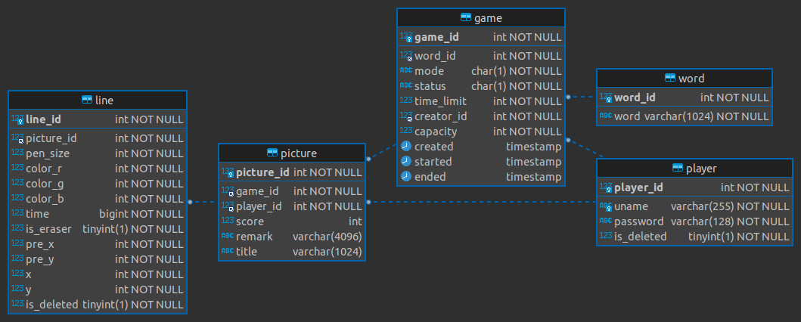
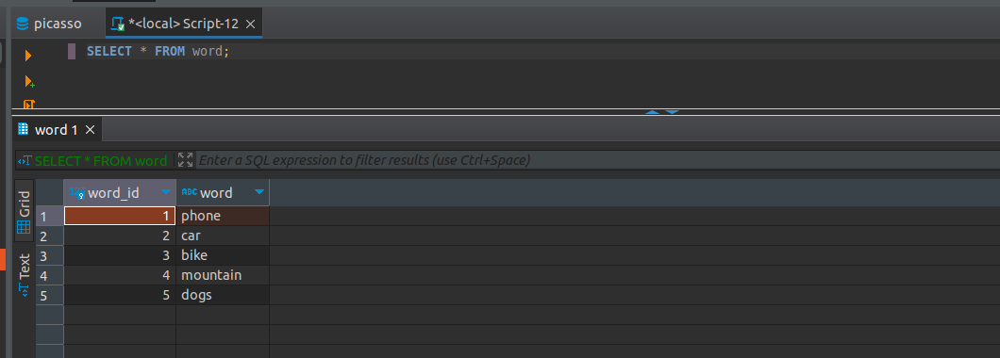
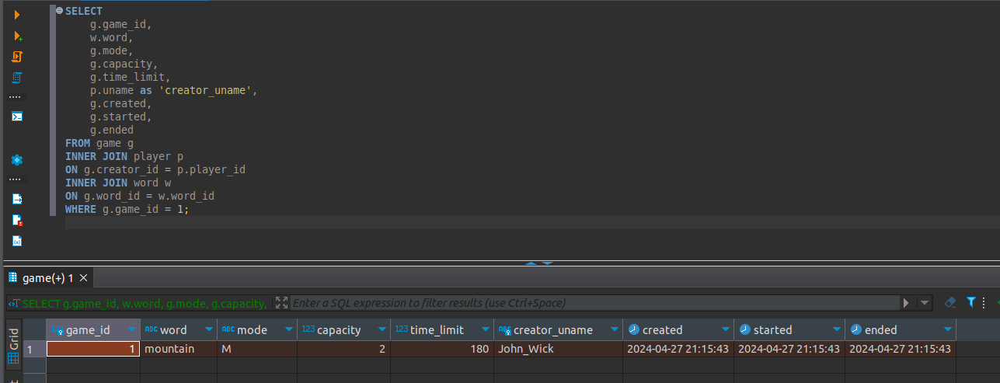
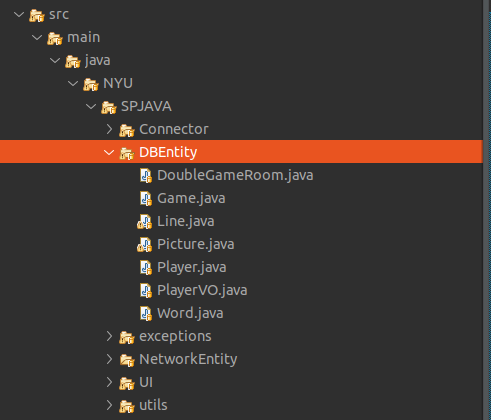
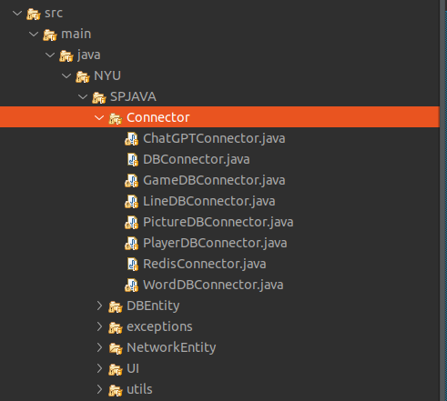
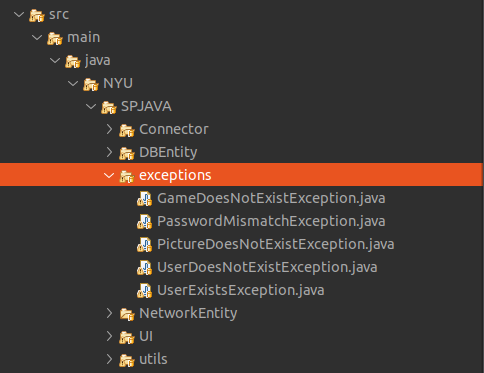
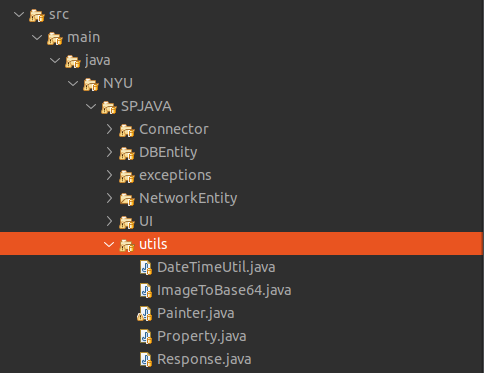

Date: May 5, 2024

Author: Rafik Saad, Shunyu Yao

# Picasso Documentation

This document will explain how to setup and run Picasso locally
and will also explain the overall design of the game

## What is picasso?

Picasso is an AI powered drawing game.
Players are given a blank canvas and a random scene to draw. The drawings are then graded by ChatGPT4.
It supports both single and dual game modes, and provides additional features such as replaying drawings.

In dual game mode, a player can send a challenge to another player for a showdown. Whoever scores higher, wins.

## Environment Setup

To run picasso locally, you'll need the following prerequisites:

-   Mysql server locally installed  (used as a back-end for the game)
-   Redis locally installed         (high-performance in memory databases for coordinating multiplayer games)
-   ChatGPT4 API key                (used for scoring your final drawing by ChatGPT)

1.  clone the picasso github repo
    
        git clone https://github.com/Jas000n/SP2024_CS9053_JAVA

2.  go to file [conf.properties](https://github.com/Jas000n/SP2024_CS9053_JAVA/blob/develop/src/main/resources/conf.properties) and fill in these fields with your own information:
    -   database.user="YOUR MYSQL USERNAME"
    -   database.password="YOUR MYSQL PASSWORD"
    -   chatgpt.api.key="YOUR API KEY"

3.  Execute the following scripts to setup your back-end:
    -   script #1: [CreateAllTables.sql](https://github.com/Jas000n/SP2024_CS9053_JAVA/blob/develop/src/main/resources/SQL/DDL/CreateAllTable.sql)  This creates the picasso database and sets up all the backend tables and relationships
    -   script #2: [addWords.sql](https://github.com/Jas000n/SP2024_CS9053_JAVA/blob/develop/src/main/resources/SQL/DML/addWords.sql)         This script populates the words table with few words for playing

That's it, now you're ready to play, simply run [Main.java](https://github.com/Jas000n/SP2024_CS9053_JAVA/blob/develop/src/main/java/NYU/SPJAVA/UI/Main.java)

## Game Demo

Download the game demo video [here](./static/demo/main_demo.mp4) to see the game in action!

As shown in the demo video, a player first registers and logs in.
In case of single-game, the player is given a random word to draw. As the player draws, all the strokes are captured and stored in the back-end
to provide the replay/repaint feature. Once the game ends, the canvas is turned into an image and sent to ChatGPT4 for scoring.
ChatGPT4 returns both a score and a remark which are displayed to the user. These information are also written to the back-end for storage.

for dual game mode, some coordination between java clients need to happen for a player to be able to issue a game challenge to another player and to view the list of online players.
for performance and scalability, this coordination is not handled by the back-end, instead it's handled by Redis, a high performance in-memory database.

The next sections will go over the overall design in more details.

## Backend Design Overview

After running the CreateAllTables script above, your back-end should look like this:

a game consists of a word chosen at random from the word table
and is created by a player whose player\_id is saved as the creator\_id,
therefore a game is made of a (word\_id, creator\_id) combination.

Each (game\_id, player\_id) combination makes up a picture\_id,
and each picture is a collection of lines saved in the lines table.

See the createAllTable DDL script for more details on each of the fields above.
For convenience, here is DDL piece for the game table, note the comments on each field

    CREATE TABLE game
    (
    game_id INT NOT NULL PRIMARY KEY AUTO_INCREMENT comment 'unique identifier for a game',
    word_id INT NOT NULL comment 'the scene for this game',
    mode CHAR(1) NOT NULL DEFAULT 'S' comment 'game mode: S: Single, M: Multi-player via waiting room, C: 2 players via challenge/invite',
    status CHAR(1) NOT NULL DEFAULT 'N' comment 'game status: N: New, A: Active, D: Done',
    time_limit INT NOT NULL DEFAULT 180 comment 'time limit in seconds',
    creator_id INT NOT NULL comment 'the player id that created this game',
    capacity INT NOT NULL DEFAULT 1 comment 'number of players participated in this game',
    created TIMESTAMP DEFAULT CURRENT_TIMESTAMP comment 'datetime this game was created',
    started TIMESTAMP comment 'datetime this game started (when moved to Active)',
    ended TIMESTAMP  comment 'datetime this game ended'
    );
    
    ALTER TABLE game ADD CONSTRAINT game_word_fk FOREIGN KEY (word_id) REFERENCES word (word_id);
    ALTER TABLE game ADD CONSTRAINT game_player_fk FOREIGN KEY (creator_id) REFERENCES player (player_id);
    -- add check constrain on mode and status values to limit choices
    ALTER TABLE game ADD CONSTRAINT game_mode_check CHECK ( mode IN ('S', 'M'));
    
    ALTER TABLE game ADD CONSTRAINT game_status_check CHECK (status IN ('N', 'A', 'D'));
    -- the game table setup allows a player to attempt the same word multiple times
    -- mode and status are CHAR(1) instead of a bit to add more flexibility

Note that all the primary keys in the database are set to AUTO\_INCREMENT, meaning, ids are automatically (and more importantly atomically)
chose by the DB, not Java. This guarantees ACID transactions and minimizes the risk that two Java clients would create the same game id.

### The Word Table

The words tables contains scenes for drawing, a scene is chosen at random for each game

Here is a sample table with few words/scenes:

### The Player Table

When players register, their information is stored here. The password is hashed using Sha256 algorithm

Here is a sample with two registered players

### The Game table

Once a player creates a game, it's saved in the game table, here is a sample game created by the player: John Wick.
Note how the SQL joins game and player tables to fetch the username for the creator and the word table for the word.

### The Picture table

The picture table shows all the drawings associated with a game. It also shows all the players who are in the same game.

For example, here is game\_id 1 that was created earlier by player: John\_Wick
It has two players: John\_Wick himself and The\_Elder, each player drew a picture and got a score and a remark from ChatGPT4.
The players can optionally title their drawings.

## Code Overview

### DBEntity Folder

Each back-end table in MySQL has a corresponding Java class that maps the SQL fields to Java fields.
For example, Game.java will map very closely to the game table in the back-end and so on.

Game, Line, Picture, Player and Word are MySQL entities, while PlayerVO and DoubleGameRoom are Redis entities.

### Connector

Each entity has a corresponding connector in the Connector folder that handles the read/write operations from and to the DB.

As mentioned before, to minimize race conditions on the back-end, all the primary keys (game\_id, player\_id, etc.)
are automatically chosen by the DB instead of the java client. That means, when a java object is first created,
its id is set to null until written to the DB. Once it's written in the DB, the DB connector will return a new instance of that object with the missing fields populated.

For example, when a game is created, a Game object is first created by a player but its game\_id is initially null. It's then passed to the createDBGame method in GameDBConnector.java
which writes the game to the game table and returns a new instance of Game with game\_id populated. This is generally true for all DB Entities and Connectors.

Another important note for connectors is that all public methods return a Response instance, the class Response.java lives in the utils folder and is described in the following section.

### Response.java

A very important class is the Response.java class in the utils folder. For flexibility, the back-end is designed independently from the front-end.
The back-end provides a public API that returns a consistent response in the form of a Response object for all its DB operations.

Regardless of success or failure of an operation, a response is always returned, the caller then needs to inspect the response code
to check for Success or failure. If a data is returned, it's put in the Response.data field, likewise, in case of failures, an exception is put in the Response.ex field.

This makes the design very flexible since we can add any UI for this game without changing any of the back-end API. Additionally, all calls to the back-end return uniform
responses.

Here are the fields expected in a back-end response:

    public class Response {
        public ResponseCode code;  // an enum, set to either ResponseCode.SUCESS in case of success or ResponseCode.FAILED in case of failure
        public String msg;  // a descriptive message with more details on the success or failure
        public Exception ex; // Exception instance in case of failure. It can then be used to re-throw or print error stack, if operation succeeded, this is set to null
        public Object data; // for DB operations that return data (i.e. SELECT statements), the data field is populated in case of SUCCESS and is set to null in case of FAILUER

Let's look at few code samples to show how to use a returned Response and how connectors return a response

Here is a code snippet to register a new player

    // create a new instance of a player.
    // at this point, this only exists locally
    Player player = new Player("John_Wick", "I am back!");  // the password is hashed and player_id is initially null
    
    // create an instance of PlayerDBConnector to interact with the back-end
    PlayerDBConnector pc = new PlayerDBConnector();
    
    // write this player to the back-end player table, i.e., register
    Response resp = pc.register(player);
    
    if (resp.code != ResponseCode.SUCCESS) {  // DB failed to register player
        resp.ex.printStackTrace();            // print the stack trace for the ex field of the response
    } else {
        player = (Player) resp.data;          // get the new instance of Player with player_id populated by the db
    }

Here is the definition of the **register** method in **GameDBConnector** which demonstrates some of the custom exceptions that can be found in the ex field of the response
Note that register method shows samples for one SUCCESS response and three FAILURE responses.

    public Response register(Player player) {
        try {
    	// first check if user exists
    	Player p = getUser(player);
    	throw new UserExistsException(null); // An existing user tries to registers. Handle in the catch
        } catch (PasswordMismatchException | UserExistsException ex) {
    	// user exists
    	String msg = String.format("User %s already exists!", player.getUname());
    	return new Response(ResponseCode.FAILED, msg, new UserExistsException(msg), null);  // a FALIURE response, note data is set to null and ex is populated
        } catch (UserDoesNotExistException ex) {
    	try {
    	    // register player and return success
    	    // data field contains new player object
    	    Player newPlayer = addUser(player);
    	    String msg = String.format("User %s registered successfully, please login!", newPlayer.getUname());
    				return new Response(ResponseCode.SUCCESS, msg, null, newPlayer);                // a SUCCESS response, note ex is set to null, data is set to Player object
    	} catch (Exception e) {
    	    String msg = String.format("Failed to create new user %s!", player.getUname());
    	    return new Response(ResponseCode.FAILED, msg, e, null);    // another FAILURE response
    	}
    
        } catch (Exception ex) {
    	// some other exceptions, return as is
    	return new Response(ResponseCode.FAILED, ex.getMessage(), ex, null);   // and another FAILURE response
        }
    }

Note that **getUser** method is a private method, it's not part of the public back-end API since it does not return a Response.
**register** first checks if getUser returns a player or throws a PasswordMismatchException or UserExistsException,
in such cases, we cannot register this player since a player with the same username exists. So **register** returns a Response indicating failure and populates the Response.ex
field with UserExistsException.

In the case **getUser** throws a **UserDoesNotExistException**, **register** then registers the player and returns a Response indicating success, the Response.data field then contains
a Player instance with the newly created player information populated.

### RedisConnector.java

In addition to the MySQL back-end, picasso implements an in-memory database (Redis) for scalability and performance. For example, all the necessary communications
between the java clients from getting a list of all players who are currently online to coordinating the notifications between players for dual games
are entirely handled by Redis without involving the MySQL back-end.

### CHATGPTConnector.java

As you've probably guessed, this connector handles the communication between java client and the AI server.
It sends the finished drawings for scoring when the game is finished, and recives a score and a remark to display to the user.

See this connector for the prompt that instructs ChatGPT to score the image. The returned score and remark are then written to the back-end using the PictureDBConnector.

### exceptions

As you've seen above, picasso has several custom exceptions to give more information about the error and to allow the front-end to use the backend public API more effectively.

### utils

Utils folder contains several utility classes including the Response class mentioned earlier.
Another notable utility class is Property.java, this class reads the configuration options set in **conf.properties** file at run-time.
For example, the db username, password and ChatGPT4 API key are read from conf.properties with the help of the Property class.

DateTimeUtil.java helps with translating local date-time to and from SQL timestamps.
Painter.java helps with UI functionality.

### UI

The UI uses Java Swing and provides a card layout that cleverly reuses the existing frame for multiple views instead of creating new frames/popups
This enhances the user experience significantly.

The UI implements features to:

-   register a player
-   login a player
-   creates a single game for single-game modes
-   issues a player challenge for dual-game modes
-   provides a review feature for replay of existing pictures

